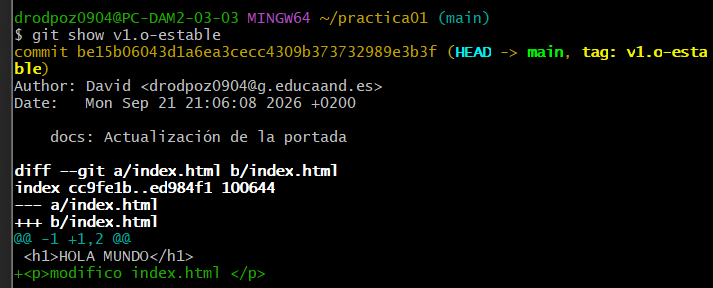

# Práctica 1.1: Git Inicial

**Alumno:** David Rodríguez Pozo

## Capturas de la práctica

### 1. Historial del repositorio
Salida del comando `git log --oneline --graph` mostrando el árbol de commits:

### 2. Etiquetas de versión
Salida de los comandos `git tag` y `git show v1.0-estable` confirmando la creación de la etiqueta:

