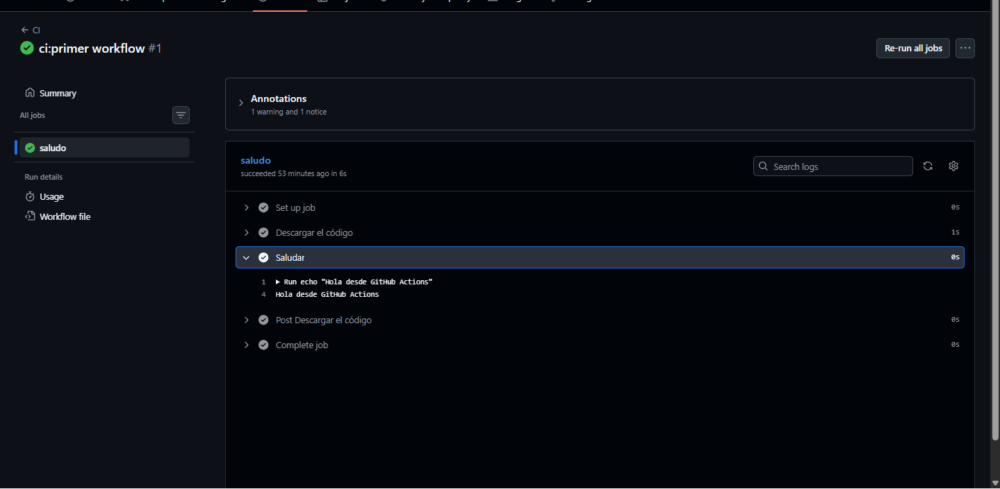
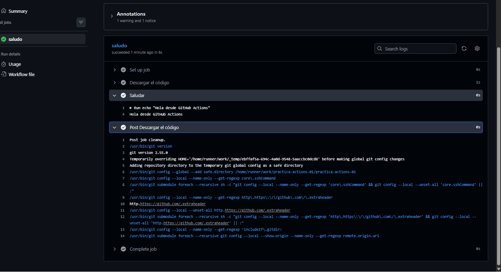
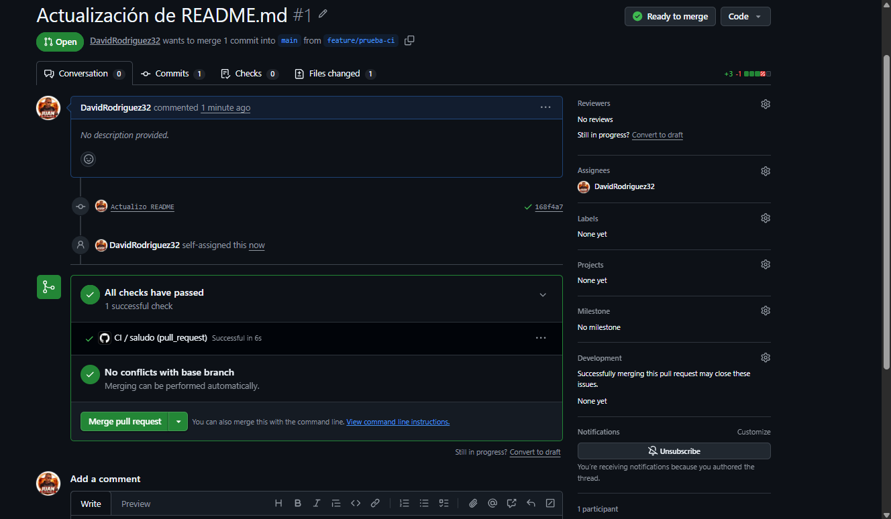

# tarea_actions_1.1

**Nombre:** David Rodriguez Pozo

---

## Capturas

A continuación se presentan las capturas de pantalla correspondientes a los requisitos de entrega del ejercicio, ordenadas según su evento disparador:

### 1. Ejecución disparada por push
Tras confirmar los cambios en local y subir los archivos a la rama principal, GitHub Actions detectó el evento e inició el flujo de forma automática.

*Descripción: Vista de la pestaña Actions que confirma el éxito del flujo tras realizar el push inicial.*

### 2. Ejecución manual (`workflow_dispatch`)
Se utilizó la interfaz web de GitHub seleccionando el flujo "CI" y haciendo clic en el botón "Run workflow" para forzar el pipeline de forma manual.

*Descripción: Registro en los logs donde se comprueba el inicio manual del flujo y la salida correcta del mensaje.*

### 3. Ejecución asociada a una Pull Request
Se creó una rama secundaria para realizar cambios en el repositorio. Al abrir la Pull Request hacia la rama principal, el workflow saltó de manera preventiva.

*Descripción: Interfaz de la Pull Request mostrando la ejecución del check de Actions vinculada directamente al evento de integración.*
