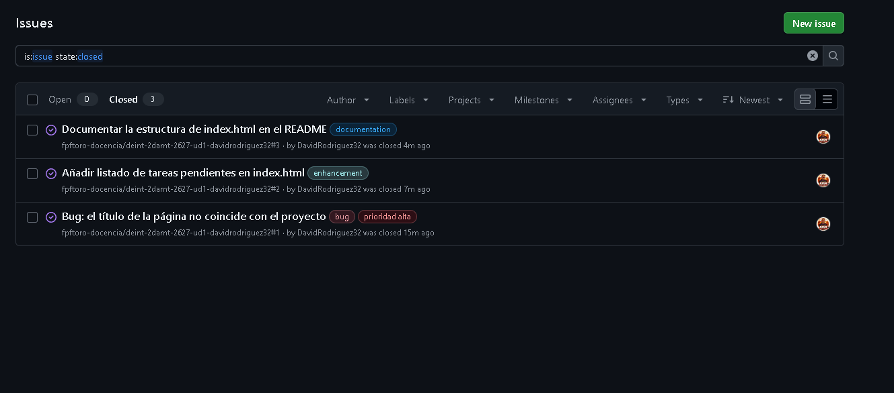
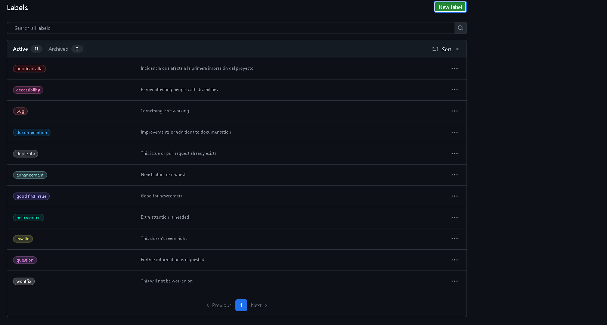
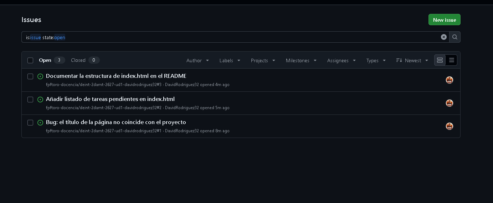
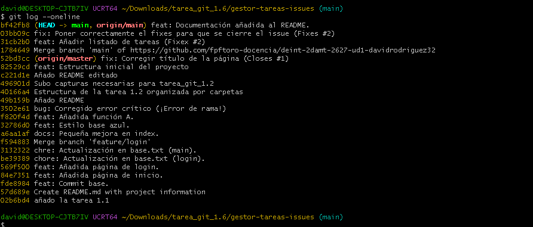

# Gestor de Tareas

Este es un proyecto sencillo para gestionar tareas y practicar con Git y GitHub.

## Estructura de index.html

El archivo principal `index.html` contiene:
* **Título (`<h1>`)**: Muestra el nombre "Gestor de Tareas".
* **Lista (`<ul>`)**: Contiene los elementos `<li>` con las tareas pendientes.

## Tarea_git_1.6
**Alumno:** David Rodríguez Pozo

En esta actividad se practica el seguimiento de incidencias con GitHub:

* Se crea un Issue para corregir el título de la página.
* Se crean Issues adicionales para añadir la lista de tareas y documentar el HTML.
* Los Issues se asignan al responsable y se clasifican con labels.
* El Issue del error y el de la mejora se cierran al subir commits con palabras clave como `Fixes #1` o `Closes #2`.
* El Issue de documentación se cierra manualmente después de actualizar este README.

El label personalizado `prioridad-alta` identifica el error del título. También se usan los labels `bug`, `enhancement` y `documentation`.

## Entrega

Estas capturas muestran las evidencias del trabajo:

### Issues cerrados

### Label personalizado

### Issues abiertos durante el trabajo

### Historial de commits

