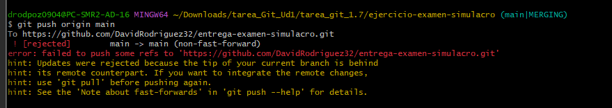
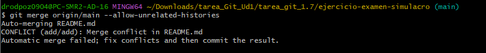
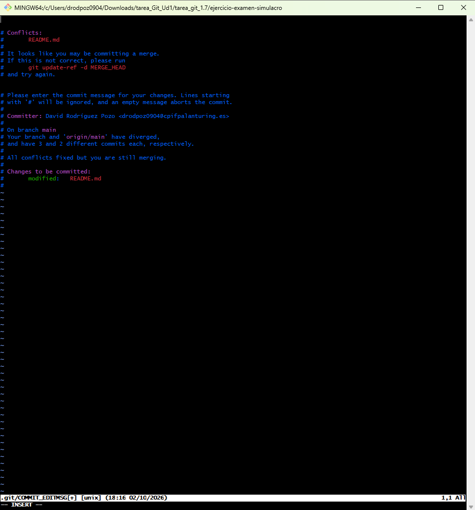
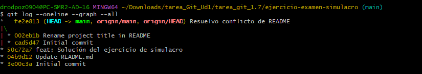
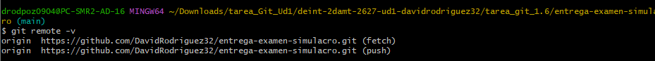

# Práctica 7: Cambio de Remoto (origin) entre Repositorios

**Alumno:** [David Rodríguez Pozo]

**URL del repositorio de entrega:** [https://github.com/DavidRodriguez32/entrega-examen-simulacro.git]

### 1. Error de push rechazado (Paso 3.3)
Captura mostrando el error al intentar subir los cambios a un repositorio remoto con un historial distinto.

### 2. Conflicto en README.md
Captura del conflicto generado al forzar la unión de los historiales.

### 3. Resolución del conflicto
Captura mostrando la resolución del conflicto en el editor y el commit resultante.

### 4. Historial del repositorio (Git log)
Captura del historial gráfico mostrando la fusión de ambas ramas.

### 5. Confirmación del remoto final
Comprobación de que `origin` apunta correctamente al repositorio de entrega.

